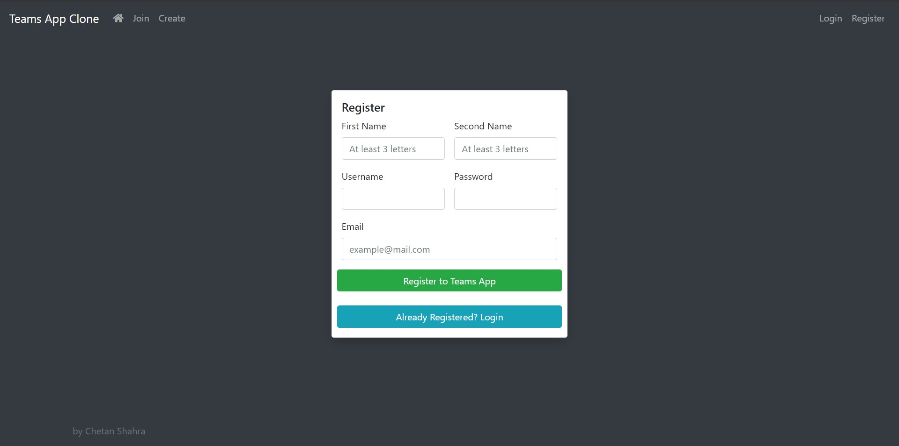
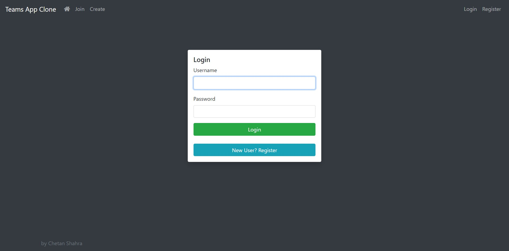
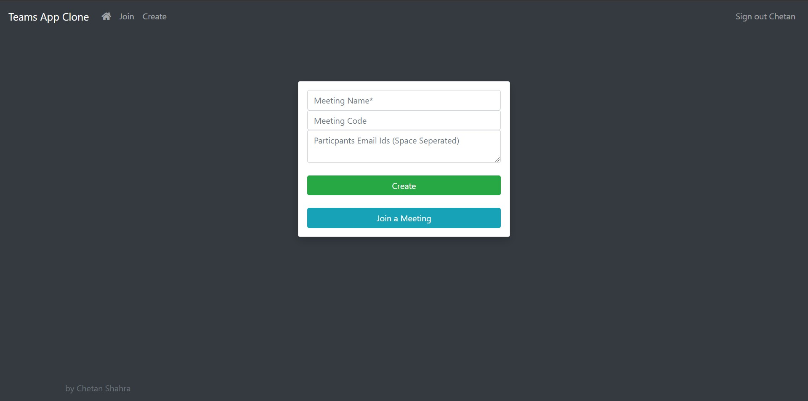
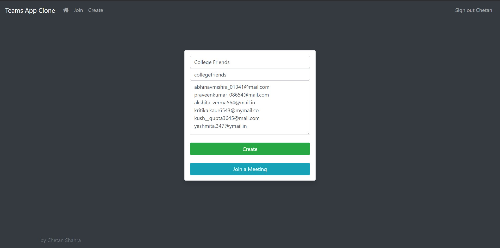
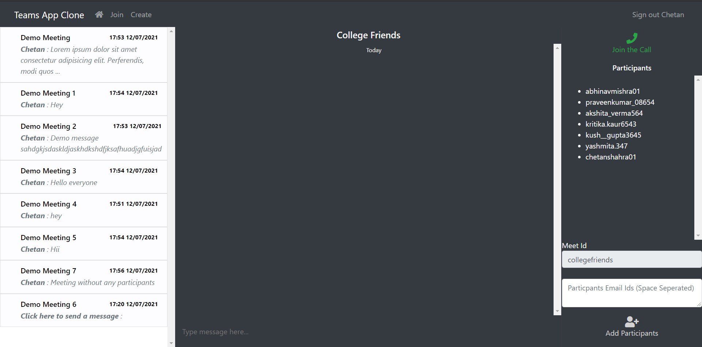
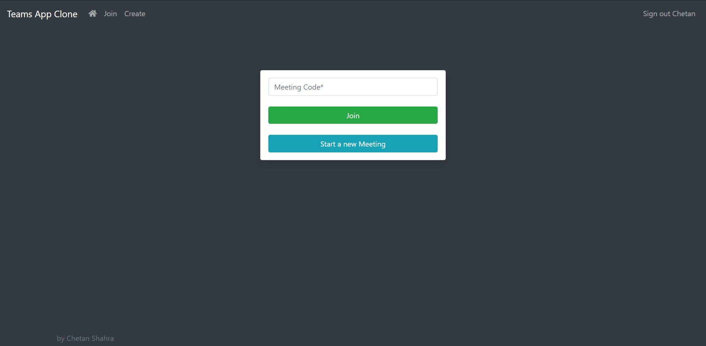

  <h1 align="center">Microsoft Teams Clone</h1>

  

    <a href="https://true-mountie-86521.herokuapp.com">View Demo</a>
    ·
    <a href="https://github.com/chetanshahra/Microsoft-Teams-Clone/issues">Report Bug</a>
  

<!-- TABLE OF CONTENTS -->

  
Table of Contents

  <ol>
    <li>
      <a href="#about-the-project">About The Project</a>
      <ul>
        <li><a href="#microsoft-engage-2021">Microsoft Engage 2021</a></li>
        <li><a href="#features">Features</a></li>
        <li><a href="#agile-methodology">Agile Methodology</a></li>
      </ul>
    </li>
    <li><a href="#usage">Usage</a>
      <ul>
        <li><a href="#register-and-sign-in">Register and Sign In</a></li>
        <li><a href="#create-new-meetings">Create New Meetings</a></li>
        <li><a href="#join-meetings">Join Meetings</a></li>
      </ul>
    </li>
    <li><a href="#resources-used">Resources Used</a>
      <ul>
        <li><a href="#languagestechnologies">Languages/Technologies</a></li>
        <li><a href="#frameworks">Frameworks</a></li>
        <li><a href="#deployment">Deployment </a></li>
      </ul>
    </li>
    <li><a href="#notes">Notes</a>
    <li><a href="#contact">Contact</a>
  </ol>

<!-- ABOUT THE PROJECT -->
## About The Project

### Microsoft Engage 2021

This project is a part of Microsoft Engage Mentorship Program 2021. It was a 4 week program organized by Microsoft India Team. The task was to build a Microsoft Teams Clone with at least one mandatory functionality, that is, a minimum of two participants should be able connect with each other to have a video conversation.
Throughout this project, my fellow mentees and I had constant support from the mentors(Ms. Salona Sinha and Mr. Nikhil Arora). Also, various AMA Sessions, Webinars and Leader talks were organized by Microsoft and Team Ace Hacker during this period.
[Microsoft Engage 2021 Website](https://microsoft.acehacker.com/engage2021)

### Features
<ol>
  <li> Group Video Calling 
      <ul>
        <li> Unlimited participants support </li>
        <li> Video On/Off Feature during call </li>
        <li> Audio Mute/Unmute Feature during call </li>
        <li> Access to chat during call </li>
      </ul>
   </li>
  <li> Chat associated with every meeting
      <ul>
        <li> Chat before or after the meeting </li>
        <li> Add new participants </li>
        <li> All the participants(including newly added) will have access to the old chats </li>
        <li> Option to join the call </li>
        <li> Navigation Bars on side and top showing options to join other meets </li>
      </ul>
   </li>
  <li> Authentication and Authorization
    <ul>
        <li> Only authenticated users have access to create and join meetings </li>
        <li> Only the users allowed can join a specific meeting </li>
        <li> Login on multiple devices allowed </li>
        <li> Users can join multiple meetings and chats at the same time from same or multiple devices </li>
      </ul>
  </li>
  <li> Completely a web-based Application: No need to install any application locally.
  </li>
</ol>

### Agile Methodology
This project is built using Agile Methodology.
Agile scrum methodology is a project management system that relies on incremental development. Usually, each iteration consists of 2-4 week sprints, where each sprint's goal is to build the most important features first and come out with a potentially deliverable product. More features are built into the product in subsequent sprints and are adjusted based on stakeholder and customer feedback between sprints.
Microsoft divided the project into 3 sprints: <em> Design, Build & Adapt </em>. Since this was a small project, so after the design phase I further divided the project into 2-3 days sprints. They are:
<ul> 
  <li>[Initialization] Setting up the server (locally)</li>
  <li>[Minimum Functionality] Enabling the connection (videos/audios) between two tabs on the same device</li>
  <li>Adding the in-call chat feature</li>
  <li>Adding <em>User Authentication</em> and basic <em>Authorization</em></li>
  <li>Adding <em>Join Meeting</em> feature and <em>Create Meeting</em> feature</li>
  <li>Adding basic Error Handling</li>
  <li>Deploying the App</li>
  <li>Giving basic User Interface</li>
  <li>Adding <em>Private Meeting</em> feature </li>
  <li>Adding <em>Add Participants Feature</em>
  <li>[Adapt Stage] Integrating the <em>before and after meeting chat</em> option with already built chat feature</li>
  <li>Adding/improving styling in the app</li>
</ul>

<!-- USAGE -->
## Usage

### Register and Sign In

Anyone can register to the App giving their basic details such as:
* Firstname and Secondname (Both must have atleast 3 characters)
* Username (Must be unique)
* Password
* Email Id (Must be unique and in the correct syntax)

  
For logging in, the registered username and password must be used

### Create New Meetings
Anyone who is logged in can create a new meeting by entering the details:
* Meeting Name
* Meeting Id : This field can also be left empty for auto-generation of id
* Participants List (includes Email Ids of the Participants with each id sepereted by a space)

Example:

On the meeting page, list of all other meetings is on the left. On the right side, going from top to bottom the option of joining the video call, list of participants and option of adding new participants to the meeting are given.

### Join Meetings
User can also join a meeting by entering the Meeting Code

<!-- ROADMAP -->
## Resources Used

### Languages/Technologies
* CSS
* JavaScript
* NodeJS
* MongodDB/Mongoose

### Frameworks
* ExpressJS
* Ejs
* Socket.io
* WebRTC
* PeerJS
* uuid
* PassportJS
* Express Flash.
* Express Session
* dotenv

### Deployment
The app is deployed using Heroku at https://true-mountie-86521.herokuapp.com/ .

## Notes
* If you are not able to join a meeting, make sure that you have been added to the Allowed Participants list of that meeting. Ask someone in the meeting to add you using the option provided.
* While registering, enter the details in correct format as mentioned <a href="#register-and-sign-in">here</a>
* In case you are providing custom meeting id, the meeting id must be unique.
* If you are facing any issue in loading/working of a particular feature, try refreashing the website. If the problem persist try changing the browser/device.

<!-- CONTRIBUTING -->
<!-- ## Contributing -->

<!-- Contributions are what make the open source community such an amazing place to be learn, inspire, and create. Any contributions you make are **greatly appreciated**. -->

<!-- 1. Fork the Project -->
<!-- 2. Create your Feature Branch (`git checkout -b feature/AmazingFeature`) -->
<!-- 3. Commit your Changes (`git commit -m 'Add some AmazingFeature'`) -->
<!-- 4. Push to the Branch (`git push origin feature/AmazingFeature`) -->
<!-- 5. Open a Pull Request -->

<!-- CONTACT -->
## Contact
Report issues: [https://github.com/chetanshahra/Microsoft-Teams-Clone/issues](https://github.com/chetanshahra/Microsoft-Teams-Clone/issues)

